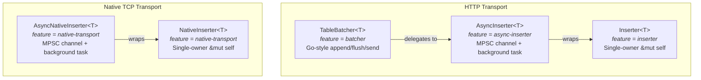
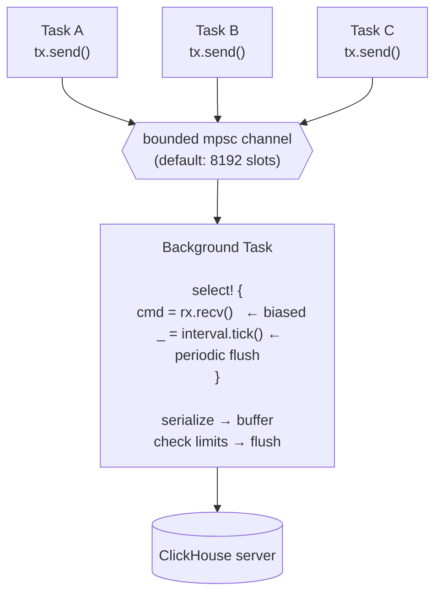

# Batching and Concurrent Inserters

This crate provides a hierarchy of inserter types for different concurrency and
transport needs. All share the same three-threshold flush policy: **row count**,
**byte size**, and **time period**.

## Inserter hierarchy



## Choosing an inserter

| Type | Transport | Concurrency | Use case |
|---|---|---|---|
| `Insert<T>` / `NativeInsert<T>` | HTTP / Native | Single owner | One-shot batch, manual control |
| `Inserter<T>` / `NativeInserter<T>` | HTTP / Native | Single owner (`&mut self`) | Long-running pipeline, single task |
| `AsyncInserter<T>` | HTTP | Multi-task (`&self` + handles) | Fan-in from many producers |
| `AsyncNativeInserter<T>` | Native | Multi-task (`&self` + handles) | Fan-in from many producers |
| `TableBatcher<T>` | HTTP | Multi-task (Go-style API) | Drop-in replacement for Go `Batch` |

## AsyncInserter / AsyncNativeInserter

Both share identical architecture — an MPSC channel feeding a background tokio
task that owns the underlying `Inserter` or `NativeInserter`:



### Key properties

- **`&self` on `write()` and `flush()`** — safe to call from multiple tasks
  without external synchronization.
- **Backpressure** — the bounded channel blocks producers when the background
  task can't keep up. Tune with `with_channel_capacity()`.
- **Error propagation** — each `write()` returns a `Result<()>` via a oneshot
  channel. Serialization or network errors are surfaced to the caller.
- **`RowOwned` requirement** — rows cross a channel boundary, so `T` must own
  its data (no borrowed `&str` fields). This is automatic for `#[derive(Row)]`
  structs with owned fields.

### Configuration

```rust
use clickhouse::async_inserter::{AsyncInserter, AsyncInserterConfig};

let config = AsyncInserterConfig::default()
    .with_max_rows(100_000)        // flush at 100K rows
    .with_max_bytes(10_485_760)    // flush at 10 MiB
    .with_max_period(Duration::from_secs(5))  // flush every 5s
    .with_channel_capacity(4096);  // backpressure at 4K pending

let inserter = AsyncInserter::<MyRow>::new(&client, "my_table", config);
```

### Handles

Handles are cheap clones of the channel sender. Use them to fan out writes
across tasks:

```rust
let inserter = AsyncInserter::<MyRow>::new(&client, "my_table", config);

for i in 0..10 {
    let h = inserter.handle();
    tokio::spawn(async move {
        h.write(MyRow { id: i, data: format!("task-{i}") }).await.unwrap();
    });
}

let stats = inserter.end().await?;  // graceful shutdown
```

### Lifecycle

1. **`new()`** — spawns background task immediately.
2. **`write(row)`** — sends row over channel; blocks if full.
3. **`flush()`** — forces immediate flush of buffered rows.
4. **`end()`** — sends shutdown command, waits for final flush, joins task.

Dropping without `end()` causes the background task to flush and exit when all
senders are dropped (including handles).

## TableBatcher

`TableBatcher<T>` is a thin wrapper over `AsyncInserter<T>` with Go client
naming conventions:

| TableBatcher | AsyncInserter | Go `Batch` |
|---|---|---|
| `append(row)` | `write(row)` | `Append(args...)` |
| `flush()` | `flush()` | `Flush()` |
| `send()` | `end()` | `Send()` |

```rust
use clickhouse::batcher::{TableBatcher, BatchConfig};

let config = BatchConfig {
    max_rows: 100_000,
    max_bytes: 10 * 1024 * 1024,
    max_period: Some(Duration::from_secs(5)),
};

let batcher = TableBatcher::<MyRow>::new(&client, "my_table", config);
batcher.append(MyRow { id: 1, data: "foo".into() }).await?;
batcher.append(MyRow { id: 2, data: "bar".into() }).await?;

let stats = batcher.send().await?;  // final flush + shutdown
```

## Default thresholds

All inserter configs share these defaults, aligned with ClickHouse server
settings and the Go client:

| Setting | Default | Rationale |
|---|---|---|
| `max_rows` | 100,000 | Upper end of recommended per-INSERT batch size |
| `max_bytes` | 10 MiB | Matches `async_insert_max_data_size` server default |
| `max_period` | 5 seconds | Balances latency vs throughput |
| `channel_capacity` | 8,192 | Backpressure threshold for concurrent inserters |

### Why client-side batching?

ClickHouse's server-side `async_insert` is convenient for distributed agents but
has drawbacks for high-throughput pipelines:

- **OOM risk** — server buffers data in memory until thresholds are met
- **Delayed visibility** — data is not queryable until the server flushes
- **Error opacity** — insert errors may be lost or delayed
- **No client control** — can't tune batch size per table or per source

Client-side batching (as implemented here) gives you immediate query visibility,
per-table tuning, and explicit error handling at the cost of managing batch
state in the client.

### MergeTree part fragmentation

Each INSERT creates one part per partition in MergeTree. Too many small INSERTs
cause part fragmentation:

- `parts_to_delay_insert` (default: 150) — slows down inserts
- `parts_to_throw_insert` (default: 300) — hard "Too many parts" error

The defaults here (100K rows, 10 MiB) are designed to produce reasonably-sized
parts. For tables with multiple partitions, adjust downward.
