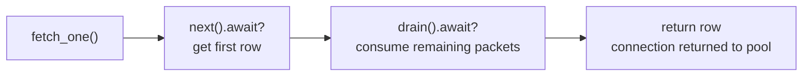
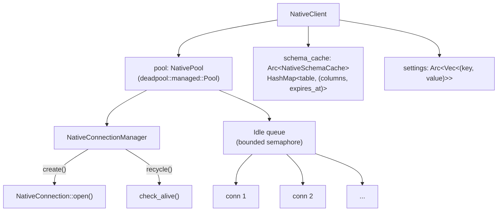

# Connection Pooling

The native transport uses [deadpool](https://docs.rs/deadpool) for connection
pooling. Each `NativeClient` owns a pool; clones share it (the pool is
`Arc`-backed internally).

## Configuration

```rust
use clickhouse::native::NativeClient;

let client = NativeClient::default()
    .with_pool_size(20);   // max 20 connections (default: 10)
```

The pool is bounded — when all connections are in use, `acquire()` waits until
one is returned. There is no idle timeout; connections persist until the client
is dropped or they fail a health check.

## Health checks (recycle)

When a connection is returned to the pool, deadpool calls `recycle()` which
runs `check_alive()`:

1. **Poisoned flag** — if `discard()` was called, the connection is dropped
   unconditionally.
2. **Buffered data** — if the `BufReader` has leftover bytes from an incomplete
   read, the connection is dropped (stale protocol state).
3. **Non-blocking poll** — a non-blocking `poll_read` detects EOF or unexpected
   server data. If either is found, the connection is dropped.

Connections that pass all three checks are returned to the idle queue for reuse.

## The discard pattern

When an I/O error or incomplete protocol exchange leaves a connection in an
unrecoverable state, call `discard()` on the `PooledConnection`. This sets a
`poisoned` flag that causes `recycle()` to drop the connection rather than
returning it to the pool.

This is used internally by:
- `NativeRowCursor::Drop` — if a cursor is dropped mid-stream (e.g. after
  `fetch_one` without draining), the connection is discarded.
- Error paths in `NativeInsert` — if an INSERT fails mid-stream, the
  connection is discarded rather than risk protocol desync.

## Cursor drain

`NativeRowCursor` provides a `drain()` method that reads and discards all
remaining server packets until `EndOfStream`. This is called automatically by
`fetch_one` and `fetch_optional` to clean up the connection before returning it
to the pool:



If `drain()` is not called (e.g. cursor dropped early), the `Drop` impl
discards the connection as a safety net.

## Pool rebuild on config change

Builder methods that affect connection parameters trigger `rebuild_pool()`,
which creates a new pool instance. Existing connections from the old pool are
not immediately closed — they drain naturally as they're returned and not
recycled into the new pool.

Affected methods:
- `with_addr()`
- `with_database()`
- `with_user()` / `with_password()`
- `with_lz4()`
- `with_pool_size()`
- `with_setting()`

## Architecture


