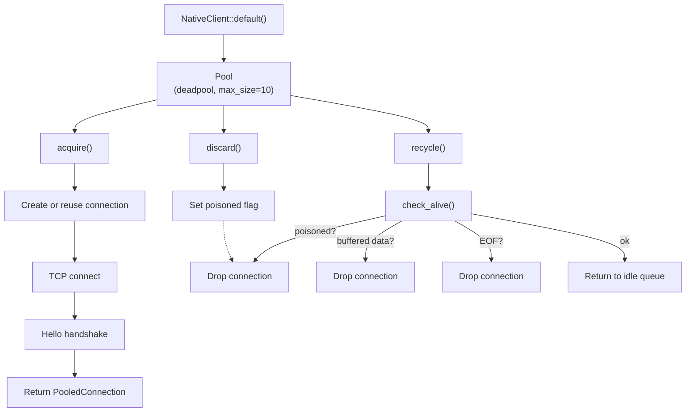

# Native Transport

The native TCP transport (`feature = "native-transport"`) connects to ClickHouse
on port 9000 using the same binary protocol as `clickhouse-client` and the Go
client (`clickhouse-go`).

## When to use native vs HTTP

| | Native (port 9000) | HTTP (port 8123) |
|---|---|---|
| Protocol | Binary, columnar blocks | Text/RowBinary over HTTP |
| Compression | LZ4 block-level (per data block) | LZ4 stream-level |
| Connection model | Persistent TCP, pooled | HTTP/1.1 keep-alive |
| Load balancer friendly | No (stateful TCP) | Yes (stateless HTTP) |
| Best for | High-throughput pipelines, co-located apps | General use, through proxies/LBs |

## Creating a client

```rust
use clickhouse::native::NativeClient;

let client = NativeClient::default()       // 127.0.0.1:9000
    .with_addr("clickhouse.internal:9000")
    .with_database("analytics")
    .with_user("writer")
    .with_password("secret")
    .with_lz4()                            // enable LZ4 compression
    .with_pool_size(20);                   // max 20 connections (default: 10)
```

`NativeClient` is `Clone` — clones share the same connection pool. Builder
methods that change connection parameters (`with_addr`, `with_database`, etc.)
rebuild the pool so the next `acquire()` opens fresh connections.

### Per-query settings

```rust
let client = NativeClient::default()
    .with_setting("select_sequential_consistency", "1")
    .with_setting("insert_quorum", "2");
```

Settings are sent in every query packet and apply to SELECT, INSERT, and DDL.

## Querying (SELECT)

```rust
use clickhouse::Row;
use serde::Deserialize;

#[derive(Row, Deserialize)]
struct Event {
    id: u64,
    name: String,
}

// Cursor — streaming, row-by-row
let mut cursor = client
    .query("SELECT id, name FROM events WHERE id > 100")
    .fetch::<Event>()?;

while let Some(row) = cursor.next().await? {
    println!("{}: {}", row.id, row.name);
}
```

### Convenience methods

```rust
// Single row (or error if none)
let row = client
    .query("SELECT id, name FROM events WHERE id = 42")
    .fetch_one::<Event>()
    .await?;

// Optional single row
let maybe = client
    .query("SELECT id, name FROM events WHERE id = 42")
    .fetch_optional::<Event>()
    .await?;

// All rows into a Vec
let all = client
    .query("SELECT id, name FROM events ORDER BY id LIMIT 1000")
    .fetch_all::<Event>()
    .await?;
```

### DDL and other statements

```rust
client.query("CREATE TABLE t (n UInt32) ENGINE = Memory")
    .execute()
    .await?;
```

## Inserting

### Single INSERT

```rust
use clickhouse::Row;
use serde::Serialize;

#[derive(Row, Serialize)]
struct Event { id: u64, name: String }

let mut insert = client.insert::<Event>("events");
insert.write(&Event { id: 1, name: "foo".into() }).await?;
insert.write(&Event { id: 2, name: "bar".into() }).await?;
insert.end().await?;  // commit — dropping without end() aborts
```

Rows are serialised to RowBinary internally, buffered, and flushed as native
columnar blocks when the buffer exceeds ~256 KiB or when `end()` is called.

### Multi-batch inserter (NativeInserter)

For long-running pipelines, `NativeInserter` automatically commits when
row/byte/period thresholds are reached — producing multiple INSERT statements:

```rust
use std::time::Duration;

let mut ins = client.inserter::<Event>("events")
    .with_max_rows(100_000)
    .with_max_bytes(10 * 1024 * 1024)  // 10 MiB
    .with_period(Some(Duration::from_secs(5)));

for event in events {
    ins.write(&event).await?;
    ins.commit().await?;  // ends INSERT only if limits are reached
}
ins.end().await?;  // final flush
```

### Concurrent inserter (AsyncNativeInserter)

For multi-task writers, `AsyncNativeInserter` moves serialisation and I/O to
a background tokio task with an MPSC channel for backpressure:

```rust
use clickhouse::native::async_inserter::{AsyncNativeInserter, AsyncNativeInserterConfig};

let config = AsyncNativeInserterConfig::default()
    .with_max_rows(100_000)
    .with_channel_capacity(4096);

let inserter = AsyncNativeInserter::<Event>::new(&client, "events", config);

// Multiple tasks can write concurrently via handles:
let handle = inserter.handle();
tokio::spawn(async move {
    handle.write(Event { id: 3, name: "baz".into() }).await.unwrap();
});

// Graceful shutdown
let stats = inserter.end().await?;
```

See [Batching](batching.md) for the full concurrent inserter architecture.

## LZ4 Compression

Enable with `.with_lz4()` on the client. This compresses:
- INSERT data blocks (both payload blocks and empty terminator blocks)
- Query result data blocks from the server

**Important**: ClickHouse sends `Log` and `ProfileEvents` blocks **uncompressed**
even when compression is negotiated. The reader handles this automatically.

## Schema Cache

The client maintains a TTL-based schema cache (default: 300 seconds) that is
populated automatically during INSERT operations when the server returns column
headers. You can also manage it explicitly:

```rust
// Pre-fetch schema from system.columns
let schema = client.fetch_schema("events").await?;
// Returns Vec<(column_name, column_type)>

// Check cache
if let Some(cached) = client.cached_schema("events") {
    println!("cached {} columns", cached.len());
}

// Invalidate
client.clear_cached_schema("events");
client.clear_all_cached_schemas();
```

## Connection lifecycle



See [Connection Pooling](connection-pooling.md) for details.
